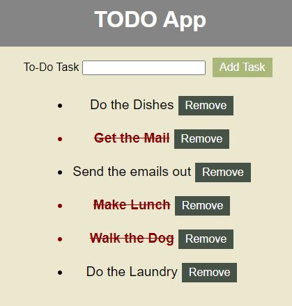

# ToDo-App

This app will allow you to create a ToDo list. It saves if the page gets refreshed. For any clarifications on how this app functions, refer to below.
- Enter a task in the form and click on the button to create the task
- If you have finished a task, you can click on the task's text to mark that you finished it
- To remove a task, you can click on the remove button and it will delete the task
